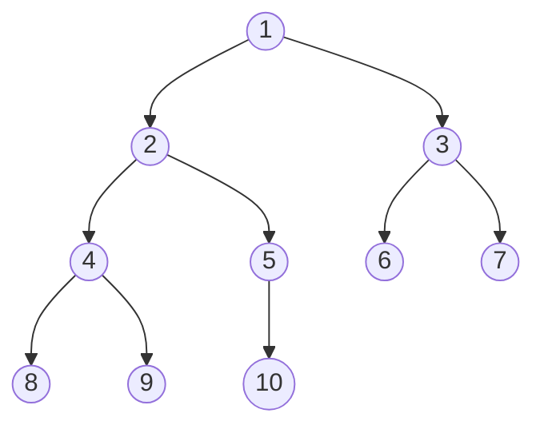

#### COM120 - Algoritmos e Programação de Computadores II

## 4. Pilhas, filas e árvores

### 4.1. Pilhas

A **pilha** é uma estrutura de dados linear que segue um padrão **Last In, First Out** (LIFO), onde o último elemento inserido é o primeiro a ser removido. As pilhas são usadas principalmente na chamada de funções, avaliação de expressão matemáticas e em algoritmos de retrocesso. 

Em uma função recursiva, por exemplo, cada nova chamada (call) da função adiciona (push) uma nova instância à pilha. Quando a chamada é feita, ela é removida (pop) da pilha, permitindo que o código continue a partir da chamada anterior.

**push()**: adiciona um elemento a pilha  
**pop()**: remove um elemento do topo da pilha  
**top()**: acessa o elemento do topo da pilha sem removê-lo  
**empty()**: verifica se a pilha está vazia

[Exemplo](code/s4-ex1.py)

 

### 4.2. Filas

Já a **fila** é uma estrutura segue um padrão **First In, First Out** (FIFO). Novos elementos são sempre adicionados ao final da fila, enquanto elementos são podem ser retirados do topo da pilha. É uma estrutura particularmente útil para quando o primeiro elemento a entrar em um conjunto também deve ser o primeiro a sair.

**insert()**: insere um novo elemento ao fim da fila  
**remove()**: remove o primeiro elemento da fila  
**empty()**: verifica se a fila está vazia  

[Exemplo](code/s4-ex2.py)

 

### 4.3. Listas

Apesar do mecanismo simples de criação e manipulação de **listas** em Python, a forma como elas são implementadas pode afetar diretamente o desempenho de uma aplicação.

No âmbito do **local** da alocação, temos a alocação sequencial e a alocação encadeada.

Na **alocação sequencial**, que é a padrão em Python, os elementos são adicionados à memória em sequência, podendo ser acessados diretamente através de índices. Em contrapartida, na **alocação encadeada**, os elementos não estão necessariamente em posições adjacentes, estabelecendo sua ordem através de ponteiros. Enquanto a abordagem encadeada permite um melhor aproveitamento da memória, ela perde o acesso direto aos elementos intermediários da lista através dos índices.

Quando ao **momento** da alocação, temos a alocação estática e a alocação dinâmica.

Na **alocação estática**, toda a memória é alocada e definida no momento da compilação, uma única vez. Enquanto isso, na **alocação  dinâmica**, a memória é alocada durante a execução do código, se tornando útil quando não se sabe de antemão quantos elementos serão adicionados à lista. A alocação dinâmica permite um gerenciamento melhor da memória, uma vez que seus elementos são definidos sob demanda, enquanto na alocação estática a memória é alocada mesmo que não ocorra o seu uso.

Por padrão, Python faz o uso da abordagem dinâmica.

Outras variações de listas incluem listas **ordenadas** e **não ordenadas** (sort()), **lineares** e **não lineares** (árvores), e **homogêneas** e **heterogêneas**.

 

### 4.4. Árvores

**Árvores** são estruturas de dados não lineares que funcionam de forma hierárquica sobre elementos chamados **nós**. Esses nós se ligam a outros nós, criando relações hierárquicas entre seus valores e procedimentos designados. Essa estrutura é normalmente utilizada em estruturas de diretórios, bancos de dados, algoritmos de busca, etc.. 

O **primeiro** nó é considerado a **raiz** da árvore, ou seja, o nó de qual todos os outros nós são derivados, enquanto os demais são classificados em relação ao seu posicionamento frente à raiz e aos outros nós. As relações entre os nós são semelhantes a uma árvore genealógica básica.

No exemplo acima, o nó **1** representa a **raiz**. O nó **2** é chamado de **nó pai** dos nós **4** e **5** que, enquanto também nós pais em relação ao seus sucessores, são considerados **nós filhos** de 2. Pode-se então dizer que o nó **2** é o nó avô de **9**. Os nós que se conectam com outros nós, como o nó **5**, são chamados de **nós interiores**, enquanto os nós que não possuem filhos, como o nó **10**, são chamados de **nós folha**. Vale lembrar que todo nó interior pode ser considerado a raiz de uma **subárvore**.

O **grau de saída de um nó** diz respeito a quantidade de filhos que ele possui; o grau de saída da **raiz** do exemplo acima é 2. Já o **grau da árvore** diz respeito ao maior grau de saída de todos os nós da árvore; no exemplo acima, 2.

O **nível** de um nó corresponde a sua distância da raiz, sendo ela o nível 0, ou seja, o nó **9** do exemplo está no nível 3. Já a **altura** de um nó corresponde a sua distância de um nó folha. A altura do nó **3** é 1. A **altura de uma árvore** é a altura de sua raiz, ou seja, a distância entre a raiz e a folha, no exemplo acima, 4.

As **árvores binárias de busca** (ABBs), também chamadas de árvores de pesquisa ou árvores ordenadas, são árvores impreterivelmente de grau 2 (**árvores binárias**), nas quais todos os nós da subárvore esquerda possuem chave (valor) menor que a chave do nó em questão, e que os nós da subárvore da direita possuem chaves maiores. Elas são eficientes para buscas, já que sua estrutura permite percorrer verticalmente toda a extensão da árvore sem repetir níveis.

| nível | quantos nós cabem? |
| --- | --- |
| 1 | 1 |
| 2 | 3 |
| 3 | 7 |
| 4 | 15 |
| 10 | 1.023 |
| 13 | 8.191 |
| 16 | 65.535 |
| 18 | 262.143 |
| 20 | 1.048.575 |
| 30 |  1.073.741.823 |
| ... | ... |
| N | 2N - 1 |